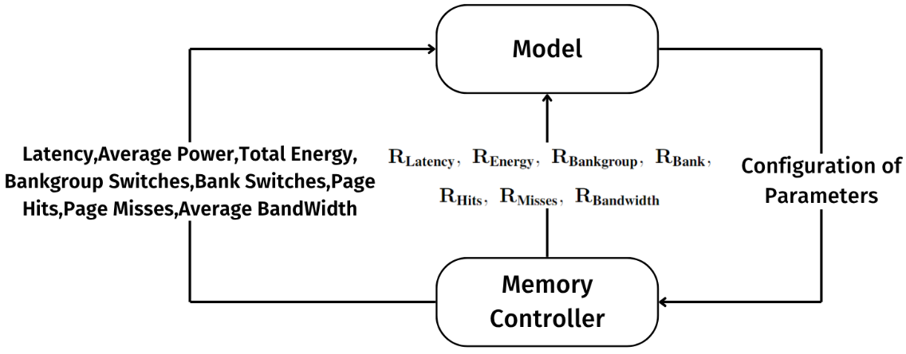
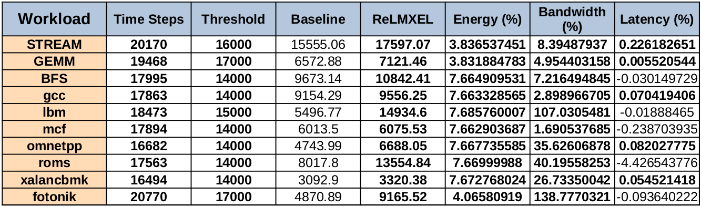

# ReLMXEL: Adaptive RL-Based Memory Controller with Explainable Energy and Latency Optimization

**ReLMXEL** is an explainable multi-agent reinforcement learning (RL) framework designed to optimize memory controller parameters, reducing latency and energy consumption while improving memory bandwidth utilization. By dynamically adjusting based on memory behavior, **ReLMXEL** enhances overall system performance while maintaining transparency and adaptability in decision-making.

## Key Features
- **RL-Based Optimization**: Uses reinforcement learning to optimize memory controller parameters for energy efficiency, latency reduction, and bandwidth improvement.
- **Explainability**: Offers transparent decision-making through an explainable framework, providing insights into how the model adapts based on workload and memory behavior.
- **Dynamic Adaptation**: Automatically adjusts to varying workload patterns, making it suitable for a wide range of applications, from memory-bound to compute-intensive tasks.

## Components
- **DRAMSys Simulator**: A highly customizable memory system simulator used to model DDR4 memory and memory controller behavior.
- **Multi-Agent RL Model**: A reinforcement learning agent that evaluates the memory controller’s performance, using feedback from multiple performance metrics.
- **Performance Metrics**: Provides detailed performance analysis, including metrics such as average energy consumption, bandwidth utilization, latency, row buffer hits/misses, bank group and bank switches.
- **Workload Traces**: Utilizes memory traces from benchmarks like **GEMM**, **STREAM**, **Breadth First Search** and workloads from **SPEC CPU 2017**, and more, to evaluate and optimize memory controller performance.


## Experimental Setup

### Requirements
To run and experiment with the **ReLMXEL** framework, you'll need:
- **Python** 3.7 or higher
- **DRAMSys Simulator** integrated with **DRAMPower**
- **Intel Pin Tool** for trace generation
- **ChampSim**

### Setup
The ReLMXEL framework requires benchmark trace files for experimentation. Trace files can be generated from the **SPEC CPU 2017** suite using ChampSim and benchmarks like **GEMM, STREAM, and BFS** using **Intel's Pin Tool**. The discount factor is chosen to be 0.9 and learning rate of 0.1 upon experimentation across workloads.

- **gamma (γ)**: Discount factor for RL, tuned from **{0.9, 0.95, 0.99}**.
- **alpha (α)**: Learning rate for the RL agent, tuned across **{0.01, 0.1, 0.3, 0.5, 0.6, 0.7, 0.8}**.
- **Trace Split Size**: Granularity of decision-making by segmenting traces into fixed-size partitions (default is **30,000**).
- **Exploration Parameter (ε_new)**: Controls the exploration-exploitation trade-off, with **ε_old** being 0.8 promoting exploration initially and **ε_new** set to **0.001** based on experimentation to promote exploitation during later stages.
- **Explainability**: We intergrated **SARSA algorithm with reward decomposition**, to not only optimize the performance but also to draw explanations for the actions taken by **ReLMXEL**.

### Baseline Configuration

The baseline configuration for memory controller parameters is set as follows:

```json
{
    "mcconfig": {
        "PagePolicy": "OpenAdaptive",
        "Scheduler": "FrFcfs",
        "SchedulerBuffer": "Bankwise",
        "RequestBufferSize": 8,
        "CmdMux": "Oldest",
        "RespQueue": "Reorder",
        "RefreshPolicy": "AllBank",
        "RefreshMaxPostponed": 8,
        "RefreshMaxPulledin": 8,
        "PowerDownPolicy": "NoPowerDown",
        "Arbiter": "Reorder",
        "MaxActiveTransactions": 128,
        "RefreshManagement": false
    }
}
```

## Results

The **ReLMXEL** framework demonstrated significant improvements in energy efficiency, latency reduction, and memory bandwidth utilization across a variety of workloads. On average, ReLMXEL improved:

- **Energy Consumption**: Reduced by 6.5% on an average compared to baseline approaches.
- **Latency**: Increased by 0.4% on an average, showcasing that latency has not been impacted significantly.
- **Bandwidth Utilization**: Enhanced by 37% on an average, leading to more efficient use of available memory bandwidth.

These improvements were consistent across multiple workloads. The adaptability of the multi-agent RL model allowed **ReLMXEL** to adjust dynamically to different workload patterns, optimizing memory performance with explainability.

